# 100DaysOfSwiftUI
This repo contains all projects of 100DaysOfSwiftUI challenge by Paul Hudson aka twostraws (Currently in progress :))
### Language used - SwiftUI

## Project 1: WeSplit
This app calculates the total per person on bill amount with selected tip percentage among a group of people. 
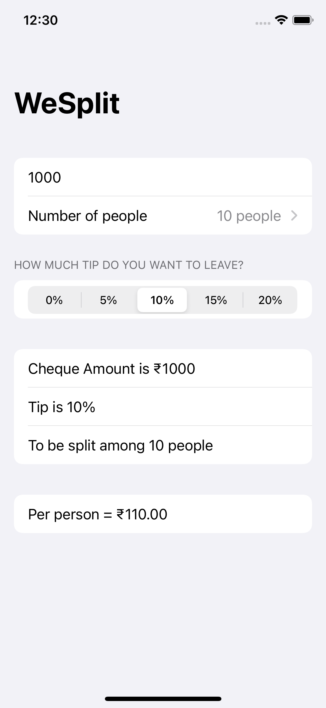 | 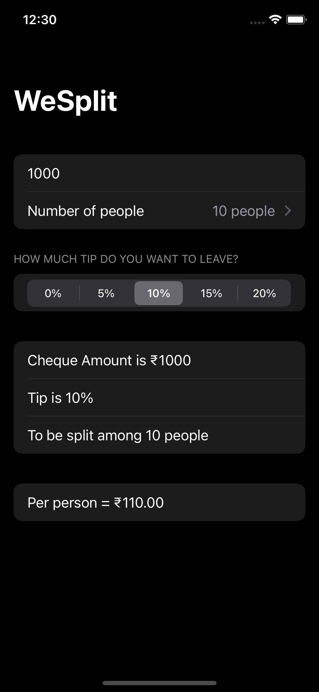
 --- | ---

## Project 2: GuessTheFlag
This is a simple game in which user has to choose the correct flag of the country. 
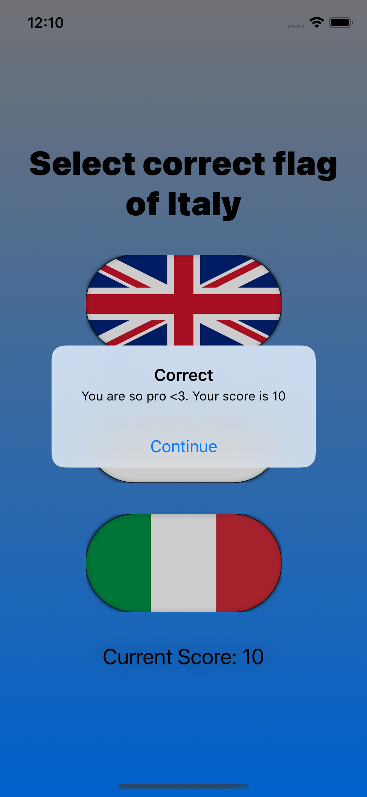 | 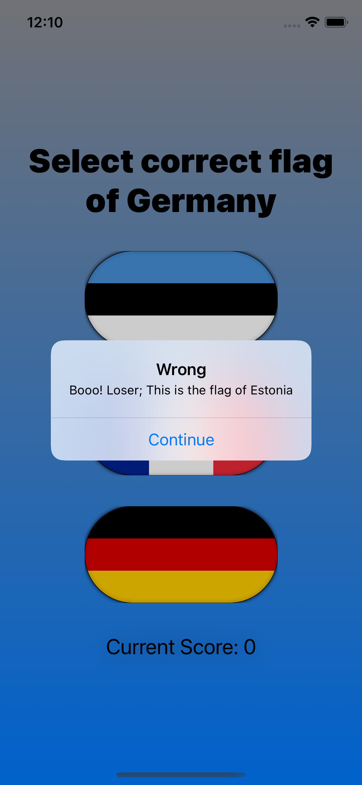 | 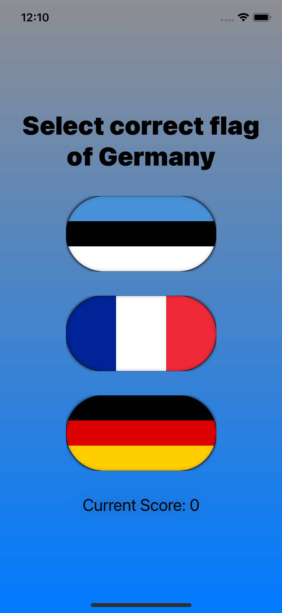
--- | --- | ---
 
We also learned different gradient types -  
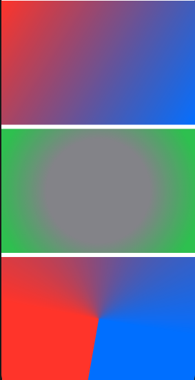

## Project 3: Views&Modifiers
This is just a simple project where we learn about modifiers and the basic functioning of `some View`.  
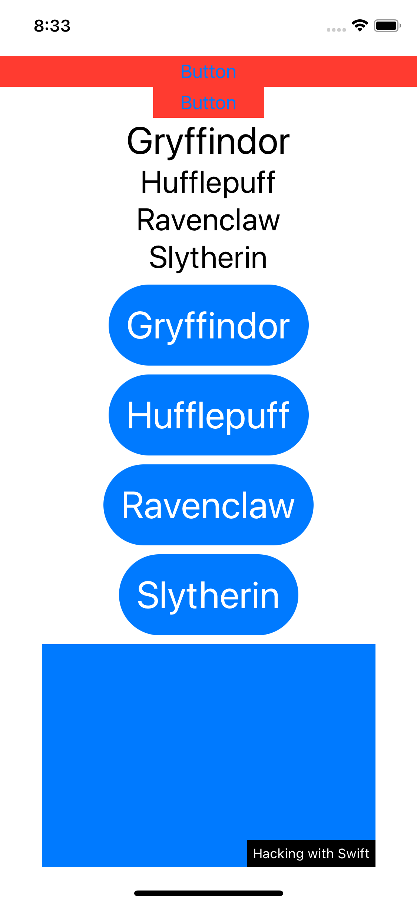

## Project 4: BetterRest
This app uses CoreML to predict the sleep time based on the user's wakeup time, sleep goal and coffee he/she drinks. 
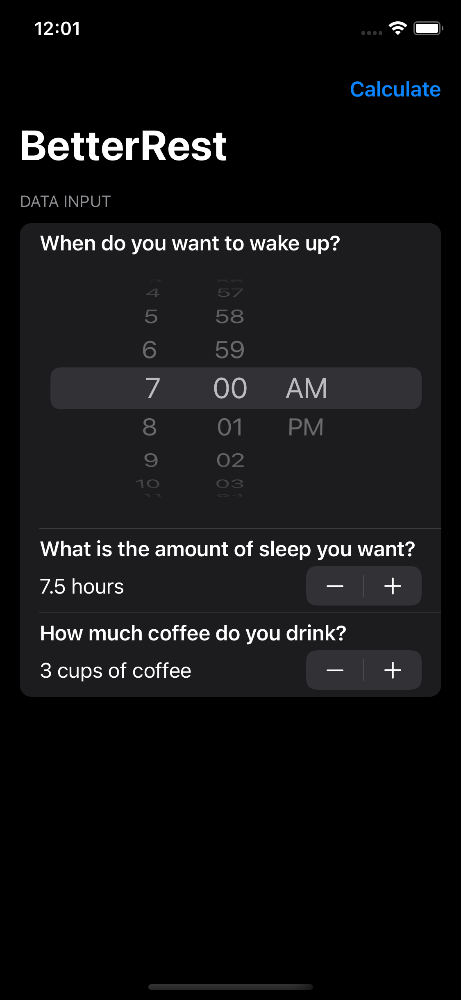 | 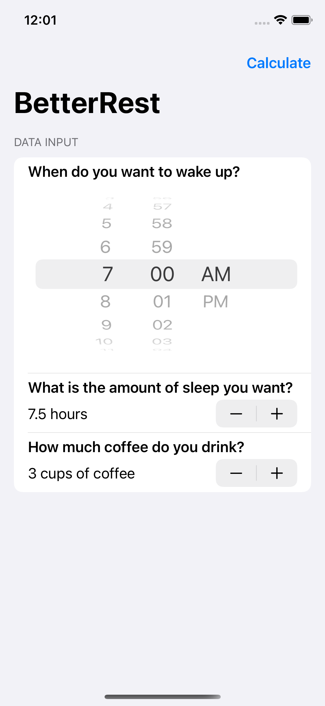 | 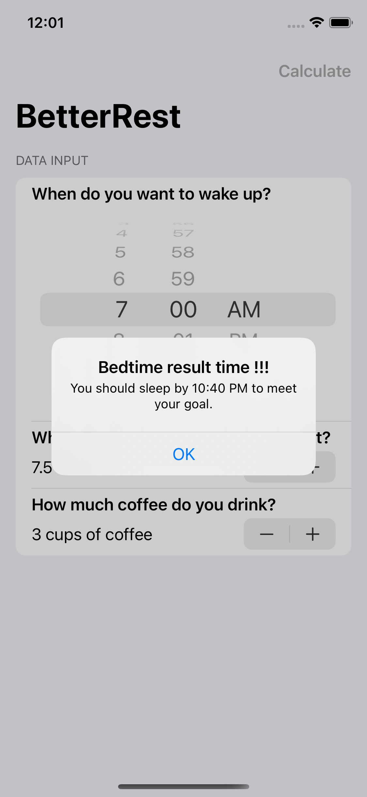
--- | --- | --- 

## Project 5: WordScramble
This is a simple game in which player has to guess the words with same letters. 
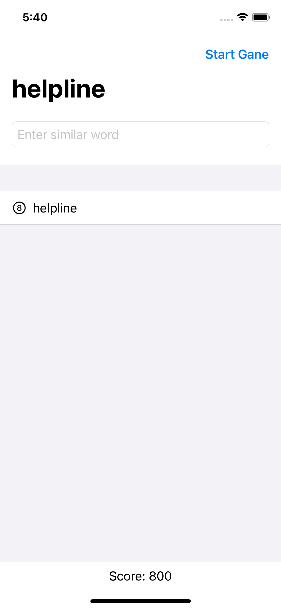 | 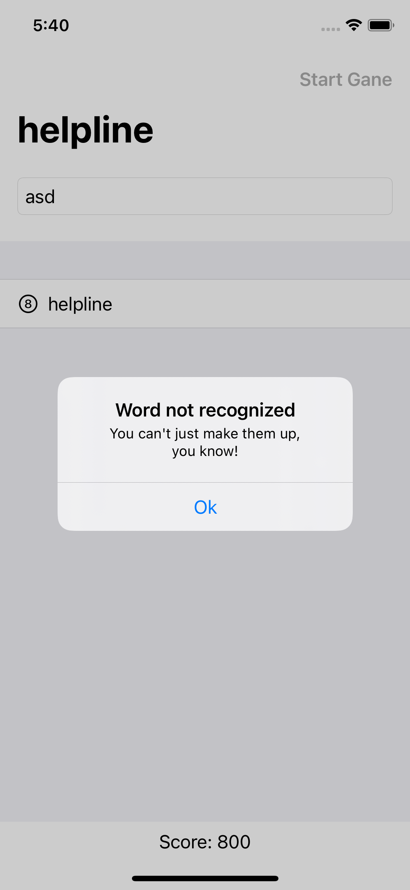
--- | --- 

We also learned different list styles  
| DefaultListStyle | GroupedListStyle |
--- | ---
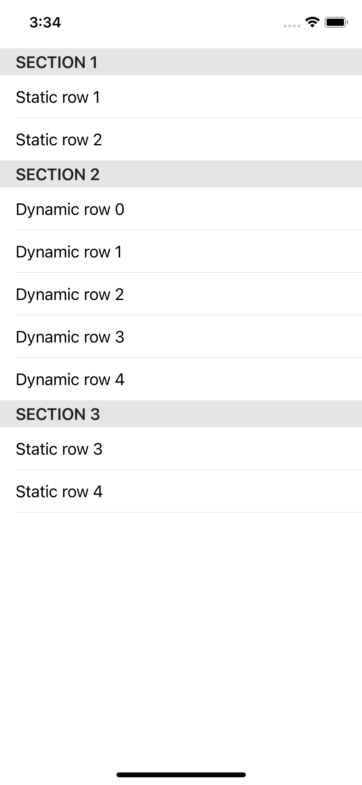 | 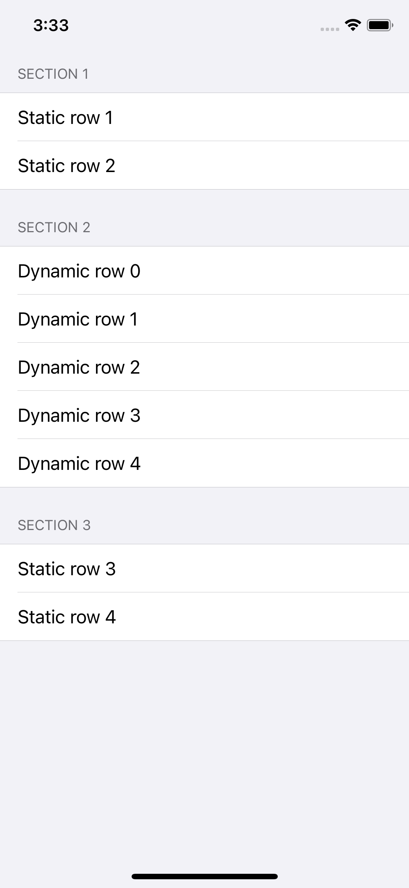

## Project 6: Animations
In this project we learned a lot of different and easy ways of adding animations using swiftUI.  
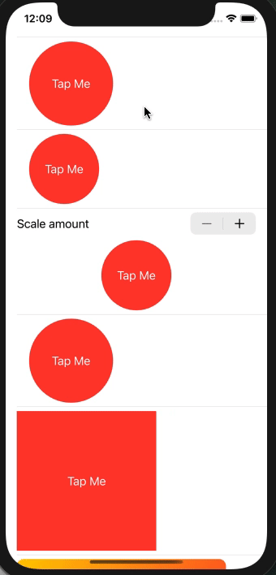

## Project 7: iExpense
This is a basic expense tracker app in which we use UserDefaults to store the expenses. 
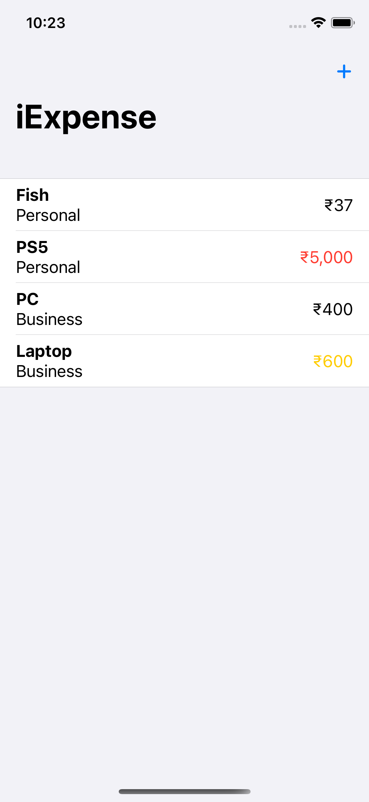 | 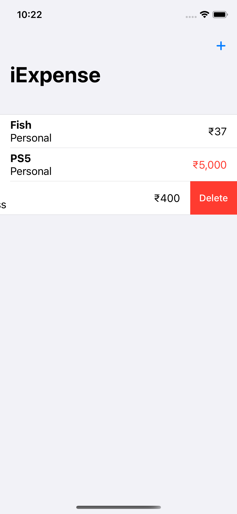 | 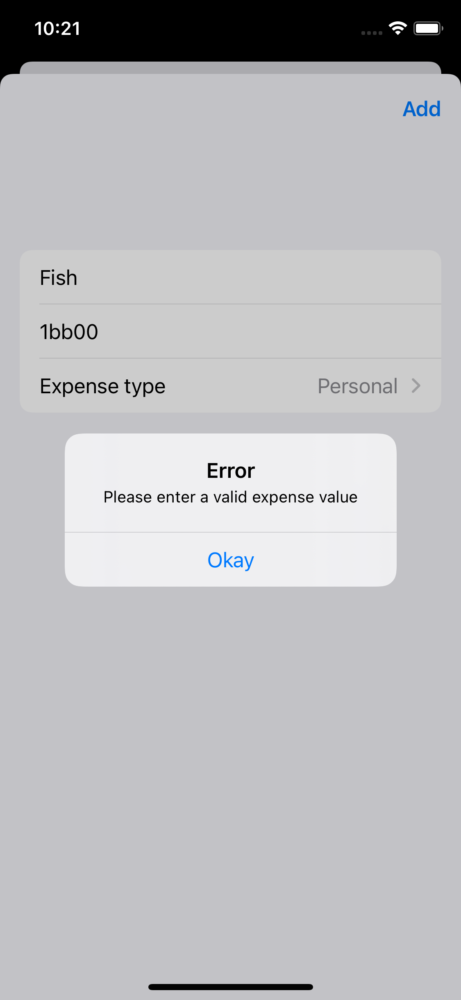 | 
--- | --- | --- | ---
# Credits
Paul Hudson aka twostraws
