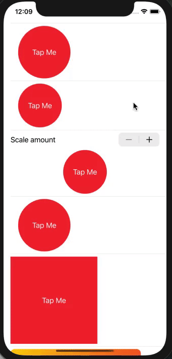
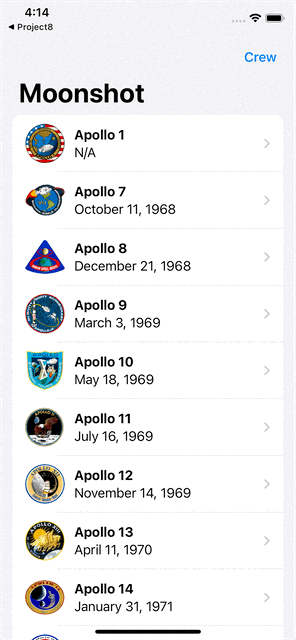
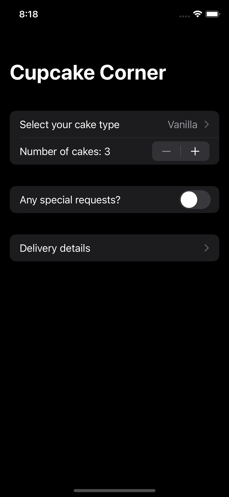
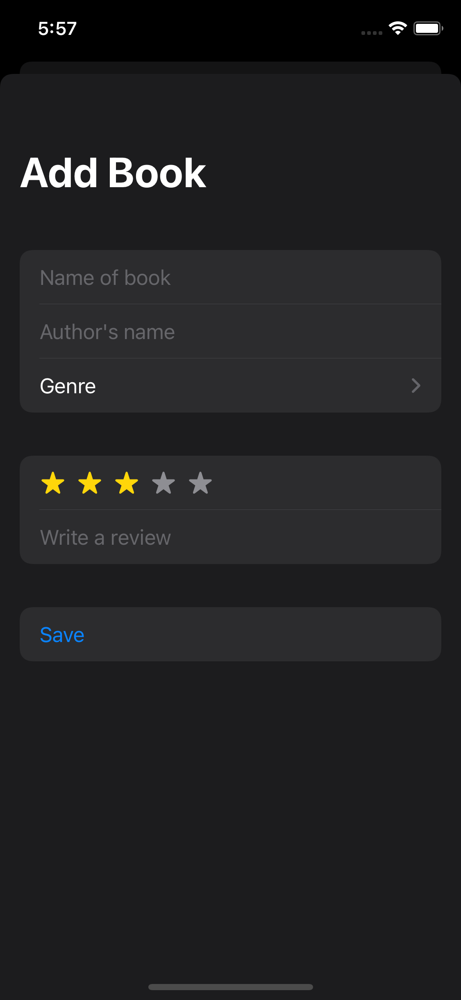
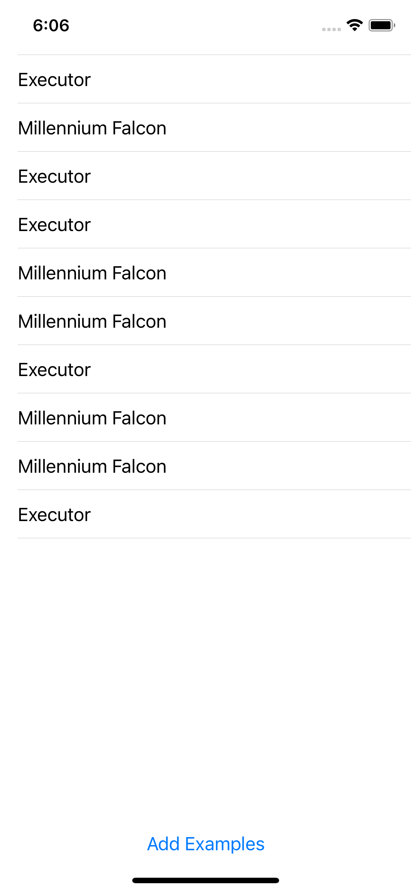
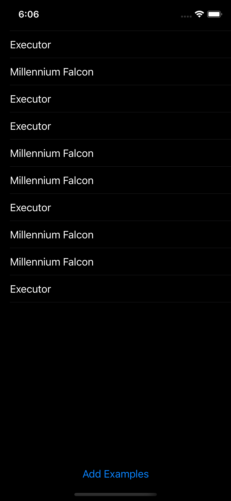
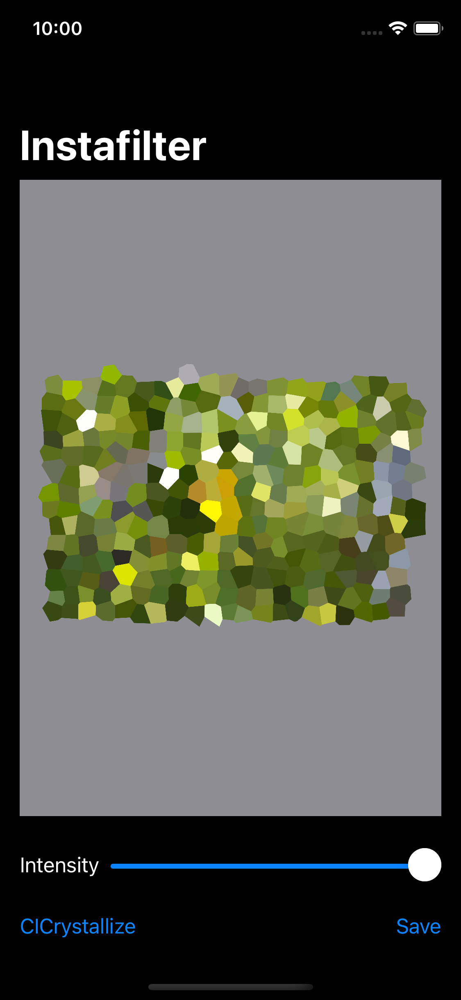
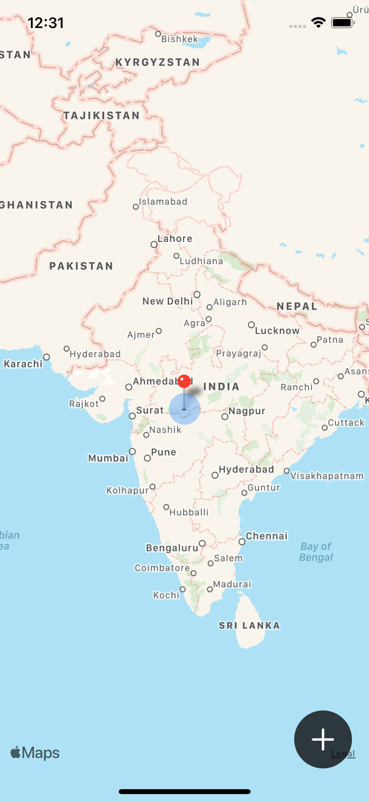

# 100DaysOfSwiftUI
This repo contains all projects of 100DaysOfSwiftUI challenge by Paul Hudson aka twostraws (Currently in progress :)) 
The following projects are something which have more of a learning when you use them in live projects.
1. Project 6: Animations
2. Project 11: BookWorm for coredata
3. Project 12: CoreDataProject for coredata

### Language used - SwiftUI

## Project 1: WeSplit
This app calculates the total per person on bill amount with selected tip percentage among a group of people. 
 | 
 --- | ---

## Project 2: GuessTheFlag
This is a simple game in which user has to choose the correct flag of the country. 
 |  | 
--- | --- | ---
 
We also learned different gradient types -   

## Project 3: Views&Modifiers
This is just a simple project where we learn about modifiers and the basic functioning of `some View`.  

## Project 4: BetterRest
This app uses CoreML to predict the sleep time based on the user's wakeup time, sleep goal and coffee he/she drinks. 
 |  | 
--- | --- | --- 

## Project 5: WordScramble
This is a simple game in which player has to guess the words with same letters. 
 | 
--- | --- 

We also learned different list styles  
| DefaultListStyle | GroupedListStyle |
--- | ---
 | 

## Project 6: Animations
In this project we learned a lot of different and easy ways of adding animations using swiftUI.   

## Project 7: iExpense
This is a basic expense tracker app in which we use UserDefaults to store the expenses. 
 |  |  
--- | --- | ---

## Project 8: Moonshot
This is a simple navigationView integrated app which show data about moon missions. 
 |  
--- | --- 

## Project 9: Drawing
This is a project that tells us about path. Project under construction 

## Project 10: CupcakeCorner
In this app we learned about published and codable. This app allows user to book cupcakes.  
 | 
--- | ---

## Project 11: BookWorm
This is a project to track books user read. We also learned about @Binding who it can change the @State also and have a code for Size Class Demo using `@Environment(\.horizontalSizeClass) var sizeClass`. If we have View A that contains inside it View B, anything in the environment for View A will also be in the environment for View B (Only in case of NavigationView). We also learned how to add that list edit functionality.
 |  
--- | --- 

## Project 12: CoreDataProject
In this app we learned `\.self` uses hasable to uniquely identify the values. This app teaches deeper coredata knowledge than the last project. This is more of a code wise project than the UI part.
 |  
--- | --- 

## Project 13: Instafilter
In this app we learned about `CoreImage` and other image related stuff. This app can apply different filters to a selected image from image picker and save it in photos.
 |  
--- | --- 

## Project 14: BucketList
This app adds map pins to desired locations with some description and wiki search. We have also used face-id to secure it.
 |  
--- | --- 
# Having trouble ?

If you are having trouble with this project or if you find any bugs, do open a new issue and describe the problem.
Alternatively, you can drop me a mail @ manas.agrawal990@gmail.com.
Spread the word!

## Follow if you like it, ⭐️ if you love it.

# Credits
Paul Hudson aka twostraws
